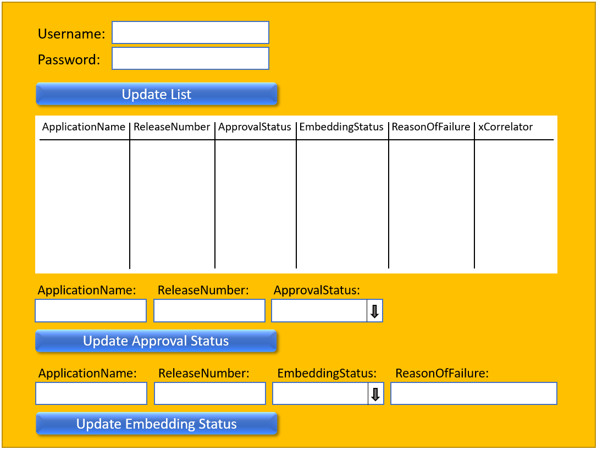

# TypeApprovalRegister Specification

When TAR://v1/start-gui gets called in a browser window, the client side code module for representing the GUI gets downloaded to the browser.  
This shall result in representation of the empty GUI.  
  

.  
User needs to fill in username and password for using the buttons for representing the list of applications in TAR or to update an approval status.  
  

.  

### ServiceList
- [TypeApprovalRegister+services](./TypeApprovalRegister+services.yaml)

### ProfileList and ProfileInstanceList
- [TypeApprovalRegister+profiles](./TypeApprovalRegister+profiles.yaml)
- [TypeApprovalRegister+profileInstances](./TypeApprovalRegister+profileInstances.yaml)

### ForwardingList
- [TypeApprovalRegister+forwardings](./TypeApprovalRegister+forwardings.yaml)

### Open API specification (Swagger)
- [TypeApprovalRegister](./TypeApprovalRegister.yaml)

### CONFIGfile (JSON)
- [TypeApprovalRegister+config](./TypeApprovalRegister+config.json)

### Comments
./.
